자바스크립트 비동기 처리
=
웹 브라우저의 가장 대표적인 엔진인 v8엔진을 기반으로 작성되었습니다.


자바스크립트의 비동기 처리는 특정 코드의 연산이 실행되고있지만 결과를 기다리지 않고 다음 코드를 먼저 실행하는 자바스크립트의 특성을 의미합니다.

## 자바스크립트 엔진
자바스크립트 동작 방식은 아래이미지로 표현이 됩니다.
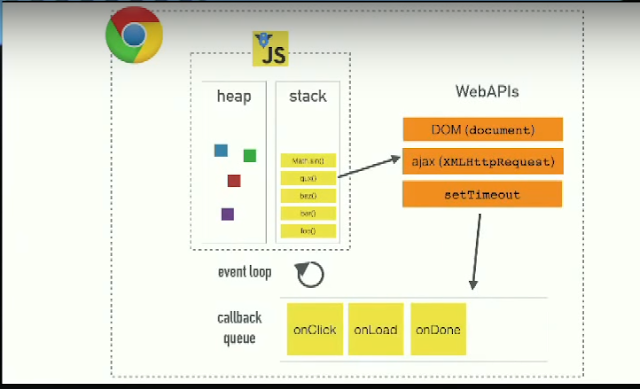

**V8엔진**은 크게 두 부분으로 구성됩니다.
- 메모리 힙 (Memory Heap) : 메모리 할당이 이루어지는 곳 
- 콜 스택 (call Stack) : 코드가 실행되면서 스택 프레임이 쌓이는곳

## 콜 스택 (Call Stack)
자바스크립트는 콜 스택이 하나이기에 싱글쓰레드 프로그래밍 언어입니다. 따라서 한번에 하나의 일만 처리할수 있습니다. 콜스택에 쌓인 함수나 코드를 위에서 아래로 차례대로 실행하며 하나의 작업이 끝나면 바로 아래의 코드를 실행합니다. 하나의 작업을 실행하고있으면 작업이 끝날때까지 다른 작업을 실행하지 않습니다.

다음 코드를 살펴보겠습니다.
```javascript
function first(){
    second();
    console.log("첫번째");
}
function second(){
    third();
    console.log("두번째");
}
function third(){
    console.log("세번째");
}
first();
```
<center>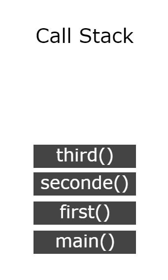</center>

main() 함수는 함수가 호출되었을때 생성되는 함수이다. 그림을 보면 third(), seconde(), first(), main() 순으로 Pop되며 main() 함수까지 실행이 완료되면 호출 스택이 지워집니다.
위 코드를 실행하면
- 세번째
- 두번째
- 첫번째

순으로 콘솔에 출력됩니다.
  
## 자바스크립트 런타임

JS가 실행되는 환경을 런타임이라고 하며 JS엔진은 V8말고도 여러가지가 있습니다.
구글 크롬이나 Node.js에서 JS코드를 실행하면 V8엔진이 코드를 인터프리팅합니다.
런타임 환경에는 WebAPIs와 EventLoop, Task Queue가 있습니다.

- WebAPIs : WebAPis는 브라우저에서 제공되는 API들이다. setTimeOut, Http 요청(ajax) 메소드, DOM 이벤트 등이 WebAPIs에 속합니다.
- Task Queue : 이벤트가 발생한 후 호출되어야 할 콜백 함수들이 대기하고있는 공간입니다. 이벤트 루프가 정해준 순서대로 대기하고 있으며 콜백 큐 라고도 합니다.
- Event Loop : 이벤트 발생 시 호출할 콜백 함수들을 관리하며, 호출된 콜백함수의 실행순서를 결정합니다.


## Task Queue
자바스크립트에서 비동기 호출되는 함수들(setTimeOut, ajax 등)은 콜 스택에 쌓이지 않고 WebAPI에서 처리 한 후 테스크 큐로 보내진다.

그럼 아래의 코드가 어떤식으로 비동기 처리가 되는지 알아보겠습니다.

```javscript
console.log("시작");

setTimeout(()=>{
    console.log("실행 중")
},3000)

console.log("종료");
```
위 코드를 실행하게 되면 실행하였을때 출력순서를 예측해보면 다음과 같은 순서의 결과값이 나올것이라 생각할 수 있습니다.
- 시작 출력
- (3초간 대기 후) 실행 중 출력
- 종료 출력
   
하지만 실제 결과는
- 시작 출력
- 종료 출력
- (3초간 대기 후) 실행 중 출력

예상과 달리 실제 결과값과 같이 출력이 된 이유는 setTimeOut()함수가 비동기 방식으로 실행되기 때문에 3초를 기다렸다가 다음 코드가 실행되는것이 아니라 setTimeOut()함수가 실행되고나서 바로 다음 코드가 실행되기 때문입니다.

그렇다면 
```javscript
console.log("시작");

setTimeout(()=>{
    console.log("실행 중")
},0)

console.log("종료");
```
그럼 위 코드는 어떻게 실행될까요?

위 코드도 마찬가지로
- 시작
- 종료
- 실행 중

순으로 실행이 됩니다. 시간이 0초 더라도 비동기 함수를 사용했으므로 WebAPIs -> 테스크 큐 -> 콜 스택순으로 이동하기 때문입니다.
여기서 중요한 점은 테스크 큐에 대기하고있는 콜백함수는 콜 스택이 비어져있을 때만 이벤트 루프가 콜 스택으로 콜백 함수를 옮겨준다는 점이다.
위 코드들이 어떻게 실행되는지 이미지로 한번 확인해보겠습니다.

<center></center>
1. 함수가 실행되면서 먼저 main()함수가 Call Stack에 쌓이고 console.log("시작)이 Call Stack에 쌓이고. 바로 실행되어 콘솔에 "시작"이 출력됩니다.
<center>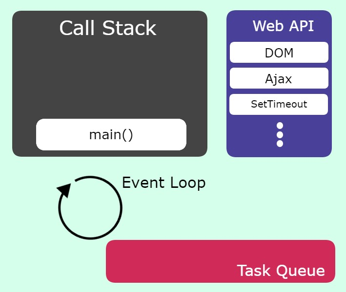</center>
2. console.log("시작")이 리턴되고 Call Stack에서 제거됩니다.
<center>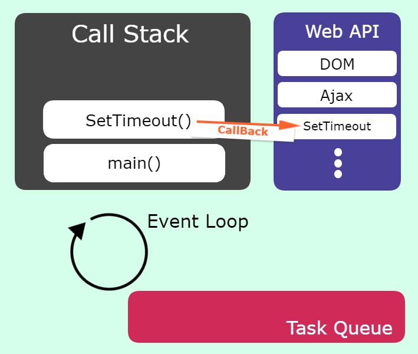</center>
3. setTimeout() 함수가 실행이 되면서 Call Stack에 setTimeout함수가 들어가고. setTimeout 함수는 콜백 함수이므로 자바스크립트 엔진이 처리하지 않고 Web API로 전달하여 작업을 요청합니다.
<center>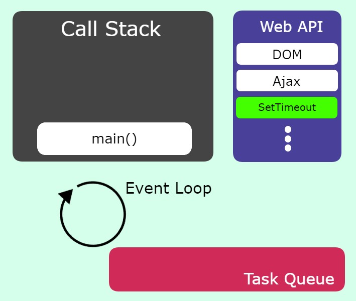</center>
4. Call Stack에서는 setTimeout이 제거되고 Web API가 setTimeout을 처리합니다.
<center>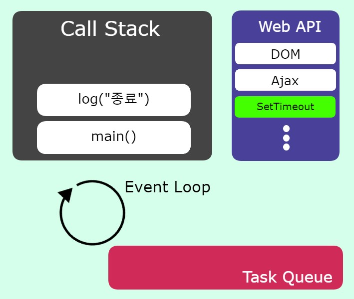</center>
5. console.log("종료") 함수가 실행되며 Call Stack에 쌓이고 실행되어 콘솔에 "종료" 가 출력된다.
<center>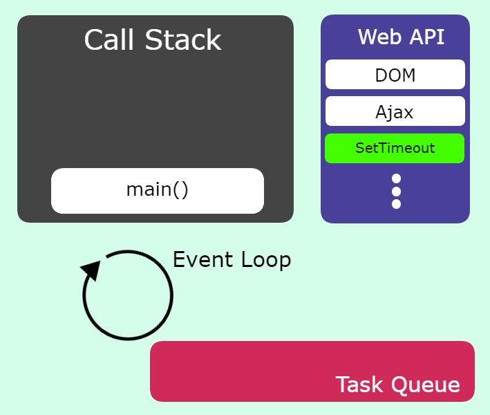</center>
6. Call Stack에 있던 console.log("종료") 함수가 리턴되며 제거된다.
<center>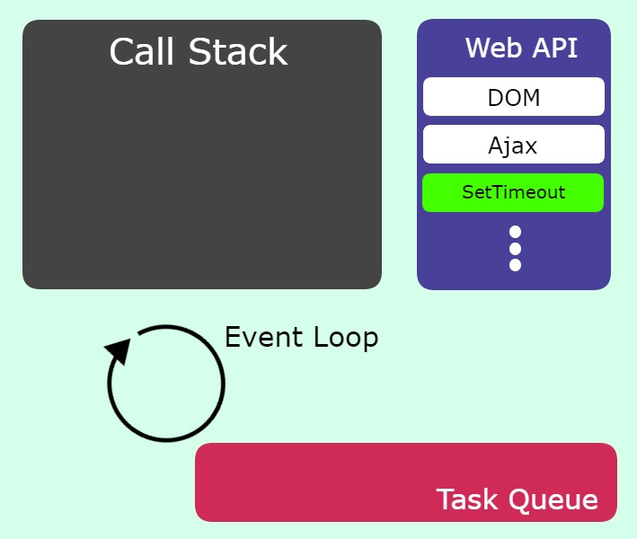</center>
7. 모든 함수의 실행이 종료되었으므료 main() 함수가 리턴되며 Call Stack에서 제거된다
<center>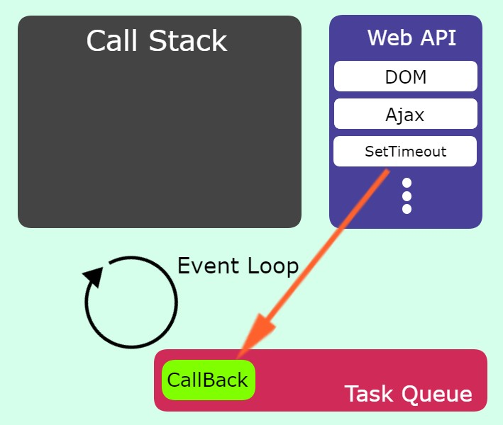</center>
8. setTimeout의 시간이 종료되었으면 Task Queue로 CallBack함수를 보내준다.
<center>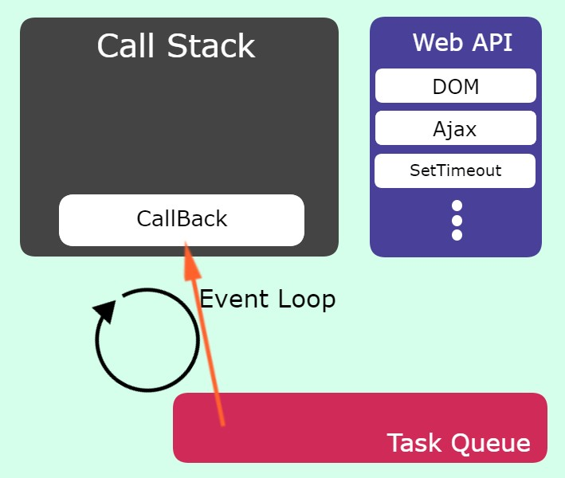</center>
9. Call Stack가 비어잇으면 Event Loop가 Task Queue에 존재하는 함수를 하나씩 꺼내 Call Stack으로 옮겨준다.
<center>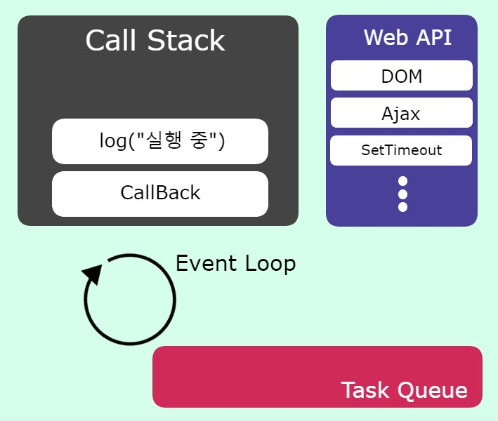</center>
10. Call Stack 함수에 들어간 console.log("실행 중")함수가 실행되고 콘솔창에는 "실행 중"이 출력된다.
<center>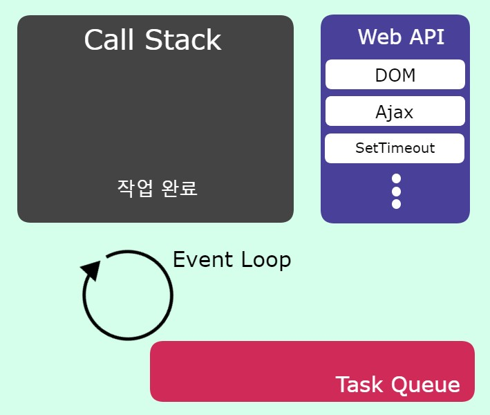</center>
11. console.log("실행 중") 함수가 리턴되고 Call Stack에서 제거되고 CallBack함수도 제거된다.

해당 루틴을 반복하며 EventLoop는 Task Queue에 새로운 콜백함수가 들어올때까지 대기한다.
만약 CallStack에 너무 많은 함수들이 있다면 setTimeout에 설정한 시간이 정확하지 않을 수 있다.

# 콜백 함수

콜백지옥 타파하기


프로미스의 3가지 상태(states)
pandding
fulfilled
rejected

error잡기는 두가지가있지만 catch 사용 권장

promise 사용

await async 사용

